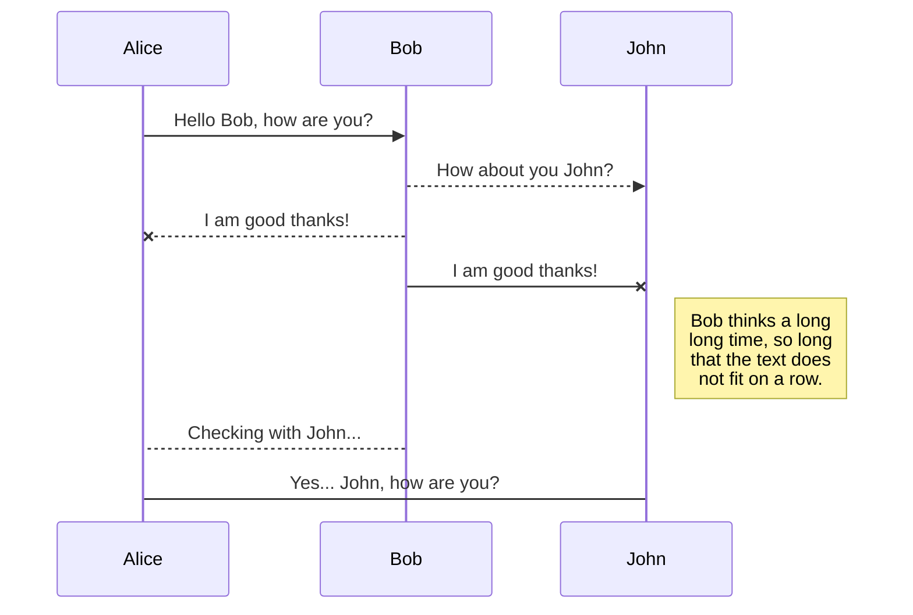
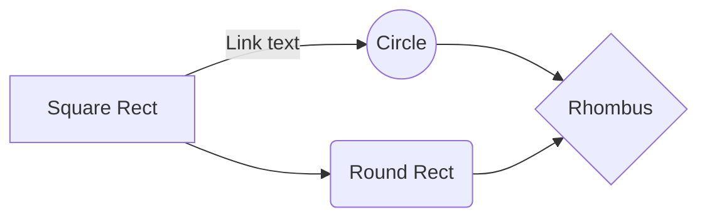

# Wyze RTSP

Download the latest RTSP firmware for Wyze cameras as Wyze.com has removed the downloads from their forums.
> **[Wyze Update](https://support.wyze.com/hc/en-us/articles/360026245231-Wyze-Cam-RTSP) 04/05/2022:** RTSP was considered a beta feature and we are currently assessing the path forward as the firmware versions have aged quite a bit. Wyze has removed the firmware files for these versions for now and will update the pages when plans are finalized. Please note that firmware files take a while to work on and test so you may not see an update in the near future. Wyze apologizes for the inconvenience.

## Highlights
- RTSP Downloads
- How to Install RTSP Firmware
- How to turn on RTSP

## Supported Cameras

 - [x] Wyze Cam v3
 - [x] Wyze Cam v2
 - [x] Wyze Cam Pan v1

# How to Install RSP Firmware

 1. Download the Wyze Cam v2 RTSP file, the Wyze Cam v3 RTSP file, or the Wyze Cam Pan RTSP file. Please note that the Wyze Cam Pan firmware file is **not**  compatible with Wyze Cam Pan v2.
 2. Choose which firmware to install:
	 - For **Wyze Cam v2 and Pan**, unzip the file and rename the contents to '**demo.bin**'. Then transfer the files to a microSD card's root directory.
		 - [Download Wyze Cam v2 Firmware](https://github.com/Lukejb14/Wyze-RTSP/blob/main/RTSP_Firmware_Downloads/demo_v2_rtsp_4.28.4.49.bin)
		 - [Download Wyze Cam Pan Firmware](https://github.com/Lukejb14/Wyze-RTSP/blob/main/RTSP_Firmware_Downloads/demo_Pan_rtsp_4.29.4.49.bin)
	 - **For Wyze Cam v3**, transfer the **‘demo_wcv3.bin’** file to a microSD card's root directory
		 - [Download Wyze Cam v3 Firmware](https://github.com/Lukejb14/Wyze-RTSP/blob/main/RTSP_Firmware_Downloads/demo_wcv3.bin)
3. Unplug your Wyze Cam and insert the prepared microSD card 
4. Hold the camera's **Setup** button while plugging in the USB cable and continue to hold the **Setup** button until the light turns **solid blue** 🔵 for **Wyze Cam v2 and Pan** or **purple** 🟣 for **Wyze Cam v3**.
5. Once the light is solid blue, release the **Setup** button and wait for 3-4 minutes. The camera will reboot, and the status light will change during this time.  
	- _Note: The "Solid Blue" in this case is not the same as the one normally seen on the cameras. It would be lighter and yellowish on Wyze Cam v2 and Pan and purple on Wyze Cam v3._
6. Once this process is finished, you should see the Wyze Cam in your Home tab **without** going through the setup process as long as it was previously paired with your account.

# How to turn on RTSP

1.  Once your Wyze Cam is back online, you can access the RTSP function from the live stream (Wyze app version 2.3 or later) under  **Settings -> Advanced Settings -> RTSP**
2.  The app will automatically check if the installed firmware version is RTSP compatible. If not, please repeat the installation process above.
3.  Next, turn on the  **RTSP toggle**
4.  You'll be prompted to set up a username and password for this Wyze Cam. Both the username and password should be 4 – 10 characters without special characters (only a-z, and 0-9)
    -   PLEASE NOTE - This username and password is unique to just this camera. Please either use something that's easy to remember or take note of them somewhere, as these will be needed to access the camera's stream via RTSP
5.  Click “**Generate URL**”, and the RTSP URL will show on the next screen. Use this for streaming through any RTSP compatible player on the same local network as the Wyze Cam.

_Note: Cam Plus is included on the Wyze Cam v3 RTSP firmware. However, there can be video lag if both functions are streaming video at the same time. We do not recommend running Cam Plus on the RTSP firmware._

### Sources
- [WYZE Cam RTSP](https://support.wyze.com/hc/en-us/articles/360026245231-Wyze-Cam-RTSP) 
- WYZE.COM Download links

You can rename the current file by clicking the file name in the navigation bar or by clicking the **Rename** button in the file explorer.

## Delete a file

You can delete the current file by clicking the **Remove** button in the file explorer. The file will be moved into the **Trash** folder and automatically deleted after 7 days of inactivity.

## Export a file

You can export the current file by clicking **Export to disk** in the menu. You can choose to export the file as plain Markdown, as HTML using a Handlebars template or as a PDF.

# Synchronization

Synchronization is one of the biggest features of StackEdit. It enables you to synchronize any file in your workspace with other files stored in your **Google Drive**, your **Dropbox** and your **GitHub** accounts. This allows you to keep writing on other devices, collaborate with people you share the file with, integrate easily into your workflow... The synchronization mechanism takes place every minute in the background, downloading, merging, and uploading file modifications.

There are two types of synchronization and they can complement each other:

- The workspace synchronization will sync all your files, folders and settings automatically. This will allow you to fetch your workspace on any other device.
	> To start syncing your workspace, just sign in with Google in the menu.

- The file synchronization will keep one file of the workspace synced with one or multiple files in **Google Drive**, **Dropbox** or **GitHub**.
	> Before starting to sync files, you must link an account in the **Synchronize** sub-menu.

## Open a file

You can open a file from **Google Drive**, **Dropbox** or **GitHub** by opening the **Synchronize** sub-menu and clicking **Open from**. Once opened in the workspace, any modification in the file will be automatically synced.

## Save a file

You can save any file of the workspace to **Google Drive**, **Dropbox** or **GitHub** by opening the **Synchronize** sub-menu and clicking **Save on**. Even if a file in the workspace is already synced, you can save it to another location. StackEdit can sync one file with multiple locations and accounts.

## Synchronize a file

Once your file is linked to a synchronized location, StackEdit will periodically synchronize it by downloading/uploading any modification. A merge will be performed if necessary and conflicts will be resolved.

If you just have modified your file and you want to force syncing, click the **Synchronize now** button in the navigation bar.

> **Note:** The **Synchronize now** button is disabled if you have no file to synchronize.

## Manage file synchronization

Since one file can be synced with multiple locations, you can list and manage synchronized locations by clicking **File synchronization** in the **Synchronize** sub-menu. This allows you to list and remove synchronized locations that are linked to your file.

# Publication

Publishing in StackEdit makes it simple for you to publish online your files. Once you're happy with a file, you can publish it to different hosting platforms like **Blogger**, **Dropbox**, **Gist**, **GitHub**, **Google Drive**, **WordPress** and **Zendesk**. With [Handlebars templates](http://handlebarsjs.com/), you have full control over what you export.

> Before starting to publish, you must link an account in the **Publish** sub-menu.

## Publish a File

You can publish your file by opening the **Publish** sub-menu and by clicking **Publish to**. For some locations, you can choose between the following formats:

- Markdown: publish the Markdown text on a website that can interpret it (**GitHub** for instance),
- HTML: publish the file converted to HTML via a Handlebars template (on a blog for example).

## Update a publication

After publishing, StackEdit keeps your file linked to that publication which makes it easy for you to re-publish it. Once you have modified your file and you want to update your publication, click on the **Publish now** button in the navigation bar.

> **Note:** The **Publish now** button is disabled if your file has not been published yet.

## Manage file publication

Since one file can be published to multiple locations, you can list and manage publish locations by clicking **File publication** in the **Publish** sub-menu. This allows you to list and remove publication locations that are linked to your file.

# Markdown extensions

StackEdit extends the standard Markdown syntax by adding extra **Markdown extensions**, providing you with some nice features.

> **ProTip:** You can disable any **Markdown extension** in the **File properties** dialog.

## SmartyPants

SmartyPants converts ASCII punctuation characters into "smart" typographic punctuation HTML entities. For example:

|                |ASCII                          |HTML                         |
|----------------|-------------------------------|-----------------------------|
|Single backticks|`'Isn't this fun?'`            |'Isn't this fun?'            |
|Quotes          |`"Isn't this fun?"`            |"Isn't this fun?"            |
|Dashes          |`-- is en-dash, --- is em-dash`|-- is en-dash, --- is em-dash|

## KaTeX

You can render LaTeX mathematical expressions using [KaTeX](https://khan.github.io/KaTeX/):

The *Gamma function* satisfying $\Gamma(n) = (n-1)!\quad\forall n\in\mathbb N$ is via the Euler integral

$$
\Gamma(z) = \int_0^\infty t^{z-1}e^{-t}dt\,.
$$

> You can find more information about **LaTeX** mathematical expressions [here](http://meta.math.stackexchange.com/questions/5020/mathjax-basic-tutorial-and-quick-reference).

## UML diagrams

You can render UML diagrams using [Mermaid](https://mermaidjs.github.io/). For example, this will produce a sequence diagram:

And this will produce a flow chart:

